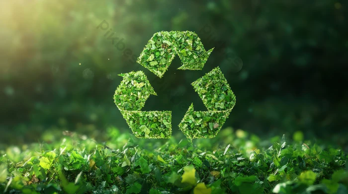

# ♻ Smart Waste Segregation & Recycling System

<p align="center">
  
</p>

<p align="center">
  <a href="#"></a>
  <a href="#"></a>
  <a href="#"></a>
  <a href="#"></a>
  <a href="#"></a>
  <a href="#"></a>
</p>

<p align="center">
  An end-to-end AI-powered waste segregation system combining <strong>computer vision</strong>, <strong>sensor fusion</strong>, <strong>servo-based sorting</strong>, and a <strong>live IoT dashboard</strong> — designed for smart cities and sustainable environments.
</p>

---

## Table of Contents

- [Overview](#overview)
- [Features](#features)
- [Architecture](#architecture)
- [ML Model & Decision Logic](#ml-model--decision-logic)
- [Sensor Fusion](#sensor-fusion)
- [Sorting Controller](#sorting-controller)
- [IoT Dashboard](#iot-dashboard)
- [Project Structure](#project-structure)
- [Setup & Installation](#setup--installation)
- [Usage](#usage)
- [Hardware Integration](#hardware-integration)
- [Demo](#demo)
- [Roadmap](#roadmap)
- [License](#license)

---

## Overview

Waste misclassification is a critical barrier to effective recycling. This system uses a **MobileNetV2 image classifier** (pretrained on ImageNet, mapped to three waste categories) fused with simulated sensor readings to make confident, multi-modal sorting decisions — then physically routes items via a servo motor into the correct bin.

| Category | Colour | Servo Angle | Examples |
|---|---|---|---|
| 🟢 Wet Waste | Green | 0° | Food scraps, fruit peels, organic matter |
| 🔵 Recyclable | Blue | 90° | Plastic bottles, cans, cardboard |
| 🔴 Hazardous | Red | 180° | Batteries, e-waste, chemical containers |

---

## Features

- **AI Classification** — MobileNetV2 / MobileNetV3 via TensorFlow Hub; 1000-class ImageNet labels mapped to waste categories
- **TFLite Support** — Lightweight inference for edge devices (ESP32, Raspberry Pi)
- **Sensor Fusion** — Combines vision confidence with moisture, gas, weight, and fill-level sensor data
- **Servo Sorting** — Simulated or real servo control (Arduino / ESP32 Serial, Raspberry Pi GPIO)
- **IoT Dashboard** — Live Flask + Socket.IO web dashboard with real-time charts
- **Webcam Mode** — Continuous live-feed classification (press `C` to classify, `Q` to quit)
- **Demo Mode** — 6-item automated demo cycle with terminal output
- **Rich Terminal UI** — Colour-coded panels and ASCII bin art (via `rich`)
- **Bin Alerts** — Automatic warnings when any bin exceeds 80% capacity

---

## Architecture

```
┌─────────────────────────────────────────────────────────────────┐
│                    SMART WASTE SYSTEM PIPELINE                  │
├──────────────┬──────────────┬──────────────┬───────────────────┤
│   INPUT      │  CLASSIFIER  │ SENSOR FUSION│  OUTPUT           │
│              │              │              │                   │
│ 📷 Image     │  MobileNetV2 │  Moisture    │  🔵 Servo → 90°   │
│ 🎥 Webcam    │  ──────────► │  Gas         │  📊 Dashboard     │
│ 🖼  Sample   │  ImageNet    │  Weight  ──► │  📟 Terminal      │
│              │  1000-class  │  Fill Level  │  📡 Serial/GPIO   │
│              │  mapping     │              │                   │
└──────────────┴──────────────┴──────────────┴───────────────────┘
```

### Block Diagram

```
           ┌──────────────┐
           │  Image Input │ ◄── ESP32-CAM / Webcam / File
           └──────┬───────┘
                  │ RGB frame
                  ▼
        ┌─────────────────────┐
        │  WasteClassifier    │  ← MobileNetV2 (TF Hub)
        │  classify_image()   │    or MobileNetV3 (TFLite)
        └────────┬────────────┘
                 │ {category, confidence, label}
                 ▼
        ┌─────────────────────┐     ┌────────────────────┐
        │  SensorFusionEngine │◄────│  SensorSimulator   │
        │  fuse(vision,sensor)│     │  moisture, gas,    │
        └────────┬────────────┘     │  weight, fill_pct  │
                 │ FusionResult     └────────────────────┘
                 ▼
        ┌─────────────────────┐
        │  ServoController    │
        │  sort(category)     │  → 0° / 90° / 180°
        └────────┬────────────┘
                 │ SortingAction
                 ▼
        ┌─────────────────────┐
        │  Dashboard / CLI    │  Flask + Socket.IO / Rich terminal
        └─────────────────────┘
```

---

## ML Model & Decision Logic

### Model

The system uses **MobileNetV2** loaded from TensorFlow Hub — a lightweight, accurate convolutional neural network pretrained on **ImageNet (1000 classes)**. No custom training is required.

```python
MODEL_URL = "https://tfhub.dev/google/tf2-preview/mobilenet_v2/classification/4"
```

For edge deployment, a **MobileNetV3-Small TFLite** model provides faster inference with a smaller footprint:

```python
tflite_model = "models/mobilenet_v3_small.tflite"
```

### Category Mapping

ImageNet labels are mapped to three waste categories using keyword matching:

| Waste Category | Example ImageNet Labels |
|---|---|
| Wet Waste | `banana`, `apple`, `orange`, `broccoli`, `pizza`, `hot dog` |
| Recyclable | `bottle`, `can`, `carton`, `cardboard`, `paper`, `plastic bag` |
| Hazardous | `battery`, `remote control`, `mobile phone`, `laptop`, `lighter` |

### Confidence Calibration

Raw softmax scores are boosted or attenuated by sensor fusion before a final decision:

```
final_confidence = clip(vision_confidence + sensor_boost, 0, 1)
```

---

## Sensor Fusion

The `SensorFusionEngine` combines four simulated sensor readings with the vision result:

| Sensor | Range | Effect |
|---|---|---|
| Moisture (%) | 0 – 100 | High moisture → boosts Wet confidence |
| Gas (ppm) | 0 – 1000 | Elevated gas → supports organic / decomposing waste |
| Weight (g) | 0 – 2000 | Heavy items may indicate hazardous (battery, device) |
| Fill level (%) | 0 – 100 | Per-bin fill; triggers alerts at ≥ 80% |

The fusion engine applies a **weighted Bayesian update** that respects the original vision confidence while integrating physical evidence. Reasoning strings explain every decision step in plain language.

---

## Sorting Controller

Servo angle mapping (SG90 / MG996R):

```
Wet Waste       →    0°   ←  left bin
Recyclable      →   90°   ↓  centre bin (neutral)
Hazardous       →  180°   →  right bin
```

PWM duty cycle formula (50 Hz):

```
duty = 2.5 + (angle / 180) × 10.0   [%]
```

Supports three control backends:

1. **Simulation** (default) — logs movements, no hardware needed
2. **Serial** — sends `SERVO:<angle>\n` to Arduino / ESP32 over UART
3. **GPIO** — direct RPi.GPIO PWM on any BCM pin

---

## IoT Dashboard

The Flask + Socket.IO dashboard displays live system state:

- 📊 Real-time waste category + confidence gauge
- 🌡 Sensor readings panel (moisture, gas, weight)
- 📦 Bin fill-level progress bars (Wet / Recyclable / Hazardous)
- ⚙ Servo angle indicator
- 🗂 Recent classification history table
- 🔄 Auto-demo loop (classifies a new item every 10 seconds)

Launch:

```bash
python main.py --dashboard
# → http://localhost:5000
```

---

## Project Structure

```
Smart-Waste-Segregation-And-Recycling-System/
├── src/
│   ├── classifier.py        # MobileNetV2 + TFLite image classifier
│   ├── sensor_fusion.py     # Sensor simulation + fusion engine
│   ├── sorting_controller.py# Servo controller (sim / serial / GPIO)
│   ├── dashboard.py         # Flask + Socket.IO IoT dashboard
│   └── main.py              # CLI entry point
├── data/
│   └── sample_images/       # Test images (JPEG/PNG)
├── models/                  # TFLite model files (.tflite)
├── docs/                    # Additional documentation
├── assets/                  # Images, diagrams, screenshots
├── notebooks/               # Jupyter exploration notebooks
├── README.md
├── LICENSE
├── .gitignore
├── requirements.txt
└── index.html               # GitHub Pages landing page
```

---

## Setup & Installation

### Prerequisites

- Python 3.9+
- pip

### 1. Clone the repository

```bash
git clone https://github.com/krss-94/Smart-Waste-Segregation-And-Recycling-System.git
cd Smart-Waste-Segregation-And-Recycling-System
```

### 2. Create a virtual environment (recommended)

```bash
python -m venv venv
source venv/bin/activate        # Linux / macOS
venv\Scripts\activate           # Windows
```

### 3. Install dependencies

```bash
pip install -r requirements.txt
```

### 4. Add sample images (optional)

Drop `.jpg` / `.png` images into `data/sample_images/`. The system ships with synthetic demo sources if no images are present.

---

## Usage

```bash
# Classify a default sample image
python main.py

# Classify a specific image
python main.py --image data/sample_images/plastic_bottle.jpg

# Live webcam mode  (press C = classify, Q = quit)
python main.py --webcam

# Launch IoT dashboard  → http://localhost:5000
python main.py --dashboard

# Run 6-item automated demo cycle
python main.py --demo

# Use TFLite model (edge / Raspberry Pi)
python main.py --tflite

# Arduino serial servo control
python main.py --serial /dev/ttyUSB0

# Quiet mode (suppress verbose output)
python main.py --quiet
```

---

## Hardware Integration

### Raspberry Pi (GPIO servo)

```python
ctrl = ServoController(gpio_pin=18)   # BCM pin 18
```

Connect SG90/MG996R signal wire → GPIO 18, power → 5V, GND → GND.

### Arduino / ESP32 (Serial)

Upload the companion sketch (`docs/arduino_servo.ino`) to your board, then:

```bash
python main.py --serial /dev/ttyUSB0
```

The Python side sends `SERVO:<angle>\n`; the Arduino replies `OK\n`.

### ESP32-CAM

Stream JPEG frames over HTTP to a local endpoint and pass the URL as `--image`:

```bash
python main.py --image http://192.168.1.42/capture
```

---

## Demo

```
╔══════════════════════════════════════════════════╗
║   Smart Waste Segregation & Recycling System     ║
║   AI + Sensor Fusion + IoT Dashboard             ║
╚══════════════════════════════════════════════════╝

╭─────────────────────────────────────────────────────╮
│            ♻  Smart Waste Segregation Result        │
│ ─────────────────────────────────────────────────── │
│ Final Category    : Recyclable                      │
│ Final Confidence  : 87.4%                           │
│ Vision Prediction : Recyclable (82.1%)              │
│ Sensor Boost      : +0.0530                         │
│ Servo Angle       : 90°                             │
│ Pipeline Time     : 1.83 s                          │
╰─────────────────────────────────────────────────────╯

  🔵 [ RECYCLE BIN   90° ] ↓↓↓
  ┌─────────────────────────────────────────┐
  │ Category   : Recyclable                 │
  │ Angle      : 90°                        │
  │ PWM Duty   : 7.500%                     │
  │ Mode       : Simulated                  │
  │ Status     : ✔ OK                       │
  └─────────────────────────────────────────┘
```

---

## Roadmap

- [ ] Custom-trained waste classifier (fine-tuned on real dataset)
- [ ] MQTT integration for cloud IoT platforms (AWS IoT / Adafruit IO)
- [ ] Mobile companion app (React Native)
- [ ] Multi-bin ultrasonic fill sensors (HC-SR04)
- [ ] QR-code waste logging and analytics export (CSV / JSON)
- [ ] Docker image for one-command deployment

---

## License

This project is licensed under the [MIT License](LICENSE).

---

<p align="center">
  Built with ❤️ for a cleaner, smarter planet 🌍
</p>
